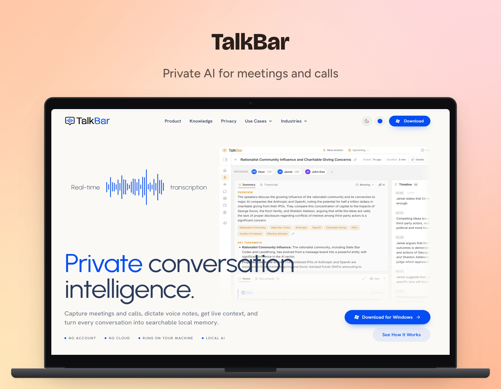

  

  <strong>Private conversation intelligence for Windows.</strong> 
  Capture meetings and calls, dictate voice notes, get live context, 
  and turn every conversation into searchable local memory.

  
  
  

  <a href="https://github.com/TalkBarApp/talkbar/releases/latest"><strong>Download for Windows</strong></a>
  &nbsp;·&nbsp;
  <a href="https://www.talkbar.app">Website</a>
  &nbsp;·&nbsp;
  <a href="https://www.talkbar.app/#features">Features</a>
  &nbsp;·&nbsp;
  <a href="https://www.talkbar.app/privacy">Privacy</a>
  &nbsp;·&nbsp;
  <a href="https://www.talkbar.app/#faq">FAQ</a>

---

## What is TalkBar?

TalkBar is a private AI note taker for Windows. It records meetings and calls
right from your desktop, using your microphone and your computer's audio, so no
bot ever joins the call. It works with Zoom, Microsoft Teams, Google Meet, other
meeting apps, and browser calls.

Transcription runs on your computer. AI can run there too, with a built-in local
model or Ollama, or you can bring your own API key when you want a stronger
model. Your sessions, notes, documents, and knowledge stay in one data folder on
your machine.

**Bot-free capture &nbsp;·&nbsp; Local transcription &nbsp;·&nbsp; Local AI or your own key &nbsp;·&nbsp; Your workspace stays on your computer**

## Before, during, and after every conversation

| Before                                | During                                   | After                                  |
| ------------------------------------- | ---------------------------------------- | -------------------------------------- |
| Prep notes and questions              | Live transcript and running summary      | Summary, decisions, and open questions |
| Documents you attach                  | Knowledge Cards and action items, on cue | Action items for the next call         |
| Knowledge Cards and open action items | Ask TalkBar, with sources                | Searchable history and exports         |

Learn more about [how it works](https://www.talkbar.app/#how-it-works).

## Features

### Capture and prepare

- **Bot-free capture.** Record meetings and calls from your desktop: your mic and your computer's audio. Nothing is added to the meeting.
- **Live transcript.** Follow the conversation with speaker labels, a timeline, and a running summary as you talk.
- **Live translation.** Read the transcript in another language with a local model, with the original beside it. English and Russian both ways, and English to Spanish, German, and French.
- **Preparation page.** Gather notes, documents, Knowledge Cards, and last time's action items for one call or a recurring series.
- **Scheduling.** Plan sessions ahead with reminders and repeats.
- **Voice notes.** Turn spoken ideas, field notes, and reflections into searchable notes.

### Remember and act

- **Knowledge Cards.** Keep the facts worth remembering, like a renewal date or an agreed price. Attach them to a call and they light up when the conversation reaches their topic.
- **Knowledge scans.** Scan past meetings or any document, then keep, edit, or dismiss each suggestion. Nothing is remembered without your OK.
- **Ask TalkBar.** Chat with one session, one document, or everything you've kept. Every answer shows where it came from.
- **Summaries and action items.** Leave each call with decisions, open questions, and action items with owners and due dates, ready to bring into the next one.
- **Documents.** Import PDFs, Word files, and Markdown to read, search, and scan.
- **People and companies.** Everyone you talk with, linked to their calls and notes.
- **Notes.** Write from more than 40 note templates and link notes to sessions, projects, or labels.

### Run it your way

- **Private AI Mode.** One switch keeps summaries, chat, dictation polish, and knowledge scans on a model installed on your computer.
- **Local AI or your own key.** Use a built-in local model or Ollama, or connect a provider with your own key. Each feature can use its own model.
- **Templates and Skills.** Start from 18 session templates, such as a sales discovery call or a candidate interview, then reorder their summary sections or add your own. Skills add outputs like a client-ready recap.
- **Retention controls.** Choose what is recorded, whether the audio is kept, and what is deleted.
- **Exports your way.** Markdown, plain text, HTML, JSON, subtitles, or ZIP, or send straight to Obsidian or Notion.
- **Your data as plain files.** Open the data folder, make a ZIP backup, and restore it anywhere.

See every feature on [talkbar.app](https://www.talkbar.app/#features).

## Privacy

TalkBar is local-first and built for sensitive conversations. Each AI feature has
its own route, so you decide what runs where:

| AI path                    | Where it runs          | What leaves your computer                   |
| -------------------------- | ---------------------- | ------------------------------------------- |
| Built-in model             | This computer          | Nothing                                     |
| Ollama on this computer    | This computer          | Nothing                                     |
| Ollama on another computer | That computer          | The text of each request, over your network |
| Your own API key           | The provider you chose | Only the text the request needs             |

Private AI Mode allows only the first two.

Apart from what you start or set up yourself (exports, shared pages,
notifications, and requests to your own AI provider), TalkBar only uses the
network for model downloads, update checks, and anonymous usage statistics,
which you can turn off in Settings. Audio, transcripts, and notes are never
included.

Read the full breakdown on the [privacy page](https://www.talkbar.app/privacy).

## Built for

| Use cases                                                          | Industries                                                                   |
| ------------------------------------------------------------------ | ---------------------------------------------------------------------------- |
| [One-on-one meetings](https://www.talkbar.app/one-on-one-meetings) | [Venture and private equity](https://www.talkbar.app/venture-private-equity) |
| [Coaching sessions](https://www.talkbar.app/coaching-sessions)     | [Legal counsel and M&A](https://www.talkbar.app/legal-counsel)               |
| [Interviews](https://www.talkbar.app/interviews)                   | [Executive leadership](https://www.talkbar.app/executive-leadership)         |
| [Podcasts](https://www.talkbar.app/podcasts)                       | [B2B sales and customer success](https://www.talkbar.app/b2b-sales)          |
| [Voice notes](https://www.talkbar.app/voice-notes)                 | [Consultants and advisors](https://www.talkbar.app/consulting)               |
| [Client calls](https://www.talkbar.app/client-calls)               | [Product research and recruiting](https://www.talkbar.app/product-research)  |

## Download and install

1. Open the [latest release](https://github.com/TalkBarApp/talkbar/releases/latest).
2. Download `TalkBar_<version>_x64-setup.exe` under **Assets**.
3. Run the installer and follow the setup.

TalkBar runs on 64-bit Windows. A Mac version is in progress.

### Updates

TalkBar keeps itself up to date. New versions download in the background and
install the next time TalkBar starts, and a banner tells you when an update is
ready or has been installed.

Want to try new features early? Turn on **Beta updates** in
**Settings → General**. Turn it off to go back to production releases.

### Releases in this repository

| Release                        | For                                                                                     |
| ------------------------------ | --------------------------------------------------------------------------------------- |
| Latest release (`vX.Y.Z`)      | Everyone                                                                                |
| Pre-release `vX.Y.Z-beta.N`    | Beta testers trying new features                                                        |
| Pre-release `vX.Y.Z-preview.N` | Preview testers. Preview installs move to the full release automatically once it ships. |

Every update is signed, and TalkBar checks the signature before installing it.

## A note on recording consent

TalkBar removes the meeting bot, not your responsibilities. Recording-consent
rules vary by region and by type of call, so follow the ones that apply to your
conversations, as you would with any notes or recording tool.

## Learn more

- Website: [www.talkbar.app](https://www.talkbar.app)
- Features: [www.talkbar.app/#features](https://www.talkbar.app/#features)
- Knowledge Cards: [www.talkbar.app/#knowledge](https://www.talkbar.app/#knowledge)
- Privacy: [www.talkbar.app/privacy](https://www.talkbar.app/privacy)
- Questions: [FAQ](https://www.talkbar.app/#faq), or send a message through the website

  © 2026 TalkBar. Built for sensitive conversations.

